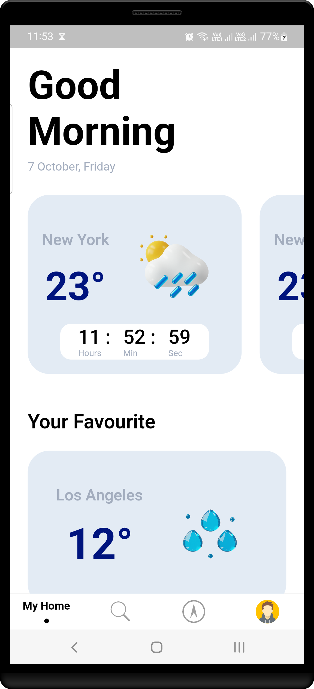

# Flutter BoilerPlate

[](https://sonarcloud.io/summary/new_code?id=NeoSOFT-Technologies_mobile-flutter) [](https://github.com/NeoSOFT-Technologies/mobile-flutter) [](https://github.com/NeoSOFT-Technologies/mobile-flutter)


## Screenshots
​           

## Table Of Content

- [Overview](#overview)
- [Getting Started](#getting-started)
    * [Requirements](#requirements)
    * [Setup](#setup)
    * [App Secrets](#app-secrets)
- [Change Package Name](#change-package-name)
- [Architecture](#architecture)
- [Running/Debugger](#flavors)
    - [Flavors](#flavors)
- [Features](#Features)
- [Library / Dependency](#Libraries-&-Tools-Used)
- [Modules](#Modules)
    * [List Default Modules](#list-default-modules)
- [Continuous Integration and Deployment](#Continuous-Integration-and-Deployment)
    - [CI](#CI)
    - [CD](#CD)
    - [Android CD setup](#Android-CD-setup)
    - [IOS CD setup](#IOS-CD-setup)

## Overview

[Flutter](https://flutter.io/) is Google's UI toolkit for building beautiful, natively compiled
applications for mobile, web, desktop, and embedded devices from a single codebase.

This is a micro-framework for Flutter which is designed to help simplify developing apps. Every
project provides a simple boilerplate to help you build apps easier.

This project is open source, we welcome any contributions.

## Getting Started

#### Requirements

Here are some things you need to prepare before this Boilerplate setup:

1. Flutter SDK Stable (Latest Version) [Install](https://flutter.dev/docs/get-started/install)
2. Android Studio [Install](https://developer.android.com/studio)
3. Visual Studio Code (Optional) [Install](https://code.visualstudio.com/)
4. **Dart** and **Flutter** extensions:
    - **Intellij Platform** users ([Dart](https://plugins.jetbrains.com/plugin/6351-dart)
      , [Flutter](https://plugins.jetbrains.com/plugin/9212-flutter) )
    - **Visual Studio Code**
      users ([Dart](https://marketplace.visualstudio.com/items?itemName=Dart-Code.dart-code)
      , [Flutter](https://marketplace.visualstudio.com/items?itemName=Dart-Code.flutter) )

#### Setup

To set up your project based on this boilerplate, you need to do some of the steps you need to do.

Here are the steps for setting up a Project with this Flutter-Works boilerplate:

**Step 1:**

In this step you need to download(cloning) the files from this repository to your local computer:

``` bash
git clone https://github.com/NeoSOFT-Technologies/mobile-flutter.git
```

Or

``` bash
git clone git@github.com/NeoSOFT-Technologies/mobile-flutter.git
```

**Step 2:**

The next step is to open the folder that has been downloaded / cloned into a cli application such
as `bash`, `cmd`, `terminal` .

After cloning the repo and follow these steps to setup the project.

Each layer of the architecture is a separate flutter package. The template
uses [`melos`](https://melos.invertase.dev/) to manage all package and performing actions like
linting and running tests accross all packages. You can setup `melos`
from [here](https://melos.invertase.dev/getting-started).

Melos can be installed as a global package,

``` bash
dart pub global activate melos
```

#### App Secrets

Sensitive information like api keys, credentials, etc should not be checked into git repos,
especially public ones. To keep such data safe the template uses `app_secrets.dart` file. If you
want to run the app locally, you will need to create a new file `app_secrets.dart`
under [`lib/secrets`](app/lib/secrets). To help with setting up the secrets file, the template
inclued a skeleton secrets file.

#### Get Dependencies

```bash
melos run get
```

#### Run Code Generation

```bash
melos run generate
```

#### Setup Hooks

```bash
bash app/scripts/setup-hooks.sh
```

Read the [scripts documentation](app/scripts/README.md) to learn about all the scripts used in the
project.

## Change Package Name

By default package names:

`com.app.flutter_template`

To change the package name, simply search for all `com.app.flutter_template`, then replace it with
the new package name, for example: `com.mycompany.`.

## Architecture

The architecture of the template facilitates separation of concerns and avoids tight coupling
between it's various layers. The goal is to have the ability to make changes to individual layers
without affecting the entire app. This architecture is an adaptation of concepts
from [`Hexagonal`](./wiki/ARCHITECTURE.md)
& [`The Clean Architecture`](https://blog.cleancoder.com/uncle-bob/2012/08/13/the-clean-architecture.html)
.

### Layers

The architecture is separated into the following layers

The architecture is separated into the following layers

- [`app`](app/): All UI and state management elements like widgets, pages and view models.
- [`core`](./core): Core business implementation
    - [`domain`](core/domain): Use cases for individual pieces of work.
    - [`data`](core/data): Repositories to manage various data sources.
    - [`shared`](core/shared): Common items for core module shared between [`domain`](core/domain)
      & [`data`](core/data).
- [`infrastructure`](./infrastructure): Services provide access to external elements such as
  databases, apis, etc.
    - [`database-floor`](infrastructure/database-floor): [Floor](https://pub.dev/packages/floor) as
      the Database provider
    - [`network-retrofit`](infrastructure/network-retrofit): [Retrofit](https://pub.dev/packages/retrofit)
      as the Database provider

Each layer has a `di` directory to manage Dependency Injection for that layer.

Read the [dependency management documentation](dependency-injection/README.md) to learn about all
the scripts used in the project.

## Flavors

The template comes with built-in support for 3 flavors. Each flavor uses a different `main.dart`
file.

- Dev - [`main_dev.dart`](app/lib/entrypoints/main_dev.dart)
- QA - [`main_qa.dart`](app/lib/entrypoints/main_qa.dart)
- Prod - [`main_prod.dart`](app/lib/entrypoints/main_prod.dart)

You can setup any environment specific values in the respective `main.dart` files.

To run a specific flavor you need to specify the flavor and target file.

```bash
 flutter run --flavor qa -t lib/entrypoints/main_qa.dart
```

**To avoid specifying all the flags every time, use the [`run.sh`](app/scripts/README.md#run)
script**

Read the [scripts documentation](app/scripts/README.md) to learn about all the scripts used in the
project.

### Entities

The layers  `core` and `services provider` within infrastructure each have an `model` directory.

- [`app layer`](https://github.com/wednesday-solutions/flutter_template/blob/main/lib/presentation/entity):
  We consume the same models used from core/domain as domain wont change in the case of frontend
  apps.
- [`core/shared/lib/src/model`](core/shared/lib/src/model): Model classes for performing business
  logic manipulations. They act as an abstraction to hide the local and remote data models.
- [`infrastructure/servicename/model`](https://github.com/wednesday-solutions/flutter_template/blob/main/lib/services/entity):
  Respective service provider contains local models (data classes for the database) and remote
  models (data classes for the api).

## Hide Generated Files (Optional)

In-order to hide generated files, navigate to `Android Studio` -> `Preferences` -> `Editor`
-> `File Types` and paste the below lines under `ignore files and folders` section:

```dart
*.config.dart;*.inject.summary;*.inject.dart;*.g.dart;
```

In Visual Studio Code, navigate to `Preferences` -> `Settings` and search for `Files:Exclude`. Add
the following patterns:

```dart
** /*.inject.summary
**/
*
.inject.
dart
*
* /*.g.dart
```

## Features

- [Hexagonal Clean Architecture](./wiki/ARCHITECTURE.md)
- Adhering to SOLID Principles
- Repository Pattern for code separations
- [Dependency Injection](./dependency-injection/)
- Network Layer
- Data Layer
- Better Logging
- [Automatic Error Handling](https://github.com/faiyyazs/flutter-errors)
- Built-in support for 3 [`flavors`](https://docs.flutter.dev/deployment/flavors) - `dev`, `qa`
  and `prod`.
- Unit & Integration Tests
- CI for build release
- Use SonarQube Analysis & generate reports
- Crashlytics/Analytics
- [Theme Manager](./themes/)
- [Localisation](./localisation/)
- Routing/Navigations
- [Responsive Framework](./wiki/responsive-framework/RESPONSIVE_FRAMEWORK.md)
- Pre-commit Checks
    - Dart Analysis
    - [`Flutter Lints`](https://pub.dev/packages/flutter_lints) for linting.
    - [Dart Fix](https://github.com/dart-lang/sdk/blob/main/pkg/dartdev/doc/dart-fix.md)
    - Flutter Format

## Libraries & Tools Used

- Dependency Injection - [Injectable](https://pub.dev/packages/injectable)
  & [GetIt](https://pub.dev/packages/get_it)
- Network - [Retrofit](https://pub.dev/packages/retrofit)
- Database - [Floor](https://pub.dev/packages/floor)
- Reactive Caching and Data-binding Framework - [RiverPod](https://riverpod.dev/)
- Bloc Framework - [Bloc](https://pub.dev/packages/flutter_bloc)
- Code Analysis - [SonarQube](https://sonarcloud.io/)
- Crashlytics - [Firebase](https://firebase.google.com/)
- Continuous Integration -  [Github Action](https://github.com/features/actions)
- [Navigation](https://docs.flutter.dev/development/ui/navigation)
- Localisation - [Flutter Intl](https://www.jetbrains.com/help/idea/managing-plugins.html)
- [Responsive Farmework](https://pub.dev/packages/responsive_framework)
- [Exception/Error Handling] (https://github.com/faiyyazs/flutter-errors)

## Modules

## List of Default Modules

By default when you use this boilerplate, there are several modules that are installed
automatically, here is a list of available modules:

| Name                                                   | Description                                                  |
| ------------------------------------------------------ | ------------------------------------------------------------ |
| [app](./app)                                           | A module containing boilerplate app view implementation      |
| [core](./core)                                         | A module containing core business implementation of the product which includes data,domain & shared modules |
| [dependency-injection](./dependency-injection)         | A module that contains classes to achieve DI across multiple modules  based on `injectable` & `getIt` |
| [infrastructure](./infrastructure)                     | A module that includes all external data providers/adapters which are outbound adapters to `core ` module/ports. Further includes `database-floor`& `network-retrofit`as external ports. |
| [localisation](./localisation)                         | A module containing translation data                         |
| [statemanagement-bloc](./statemanagement-bloc)         | A module which contains `bloc` used as a state management tool. To be used with [statemanagement-core](./statemanagement-core) |
| [statemanagement-core](./statemanagement-core)         | A module which includes base classes required to support state management in flutter. |
| [statemanagement-riverpod](./statemanagement-riverpod) | A module which contains `riverpod` used as a state management tool. To be used with  [statemanagement-core](./statemanagement-core) |
| [themes](./themes)                                     | A library that contains theme manager implementation         |

## Continuous Integration and Deployment

The Flutter template comes with built-in support for CI/CD using Github Actions.

### CI

The [`CI`](.github/workflows/ci.yml) workflow performs the following checks on every pull request:

- Lints the code with `flutter analyze`.
- Runs tests using `flutter test`.
- Build the android app.
- Build the ios app.

### CD

The [`CD`](.github/workflows/cd.yml) workflow performs the following actions:

- Bump the build number by 1.
- Build a signed release apk.
- ~~Upload apk to the app center.~~
- Upload apk as artifact to release tag.
- ~~Build a signed iOS app.~~
- ~~Upload ipa to testflight.~~
- Upload the ipa as an artifact to release the tag.
- Commit the updated version to git.

### Android CD setup

For the android CD workflow to run, we need to perform the following setup steps:

- Follow these instructions
  to [generate an upload keystore](https://developer.android.com/studio/publish/app-signing#generate-key)
  . Note down the `store password`, `key alias` and `key password`. You will need these in later
  steps.
- Use `openssl` to convert the `jks` file to `Base64`.

```bash
openssl base64 < app_key.jks | tr -d '\n' | tee app_key_encoded.txt
```

- Store the `base64` output
  on [`Github Secrets`](https://docs.github.com/en/actions/security-guides/encrypted-secrets) with
  the key name `KEYSTORE`.
- Save the `store password` in github secrets with the key name `RELEASE_STORE_PASSWORD`.
- Save the `key alias` in github secrets with the key name `RELEASE_KEY_ALIAS`.
- Save the `key password` in github secrets with the key name `RELEASE_KEY_PASSWORD`.
- [Create a distribution on app center](https://docs.microsoft.com/en-us/appcenter/distribution/)
  and get the upload key. You can get it from appcenter.ms/settings.
- Save the app center upload key on github secrets with key name `APP_CENTER_TOKEN`.

### IOS CD Setup

For the IOS job in the `cd.yml` to run, you first need to have a
valid [Apple Developer Account](https://developer.apple.com/).If you don't have it yet, please
create one before proceeding further

We will divide the guide into steps so that it is easier to understand

#### Step 1: Setup on the AppStore

- Register your `Bundle ID`. You can view the official Flutter
  guide [here](https://docs.flutter.dev/deployment/ios#register-a-bundle-id)

> CAUTION: Apple doesn't allow underscore in the bundle identifier. Read about valid identifiers [here](https://developer.apple.com/documentation/bundleresources/information_property_list/cfbundleidentifier)

- Create an application on the AppStore Connect Portal. Check out the official
  guide [here](https://docs.flutter.dev/deployment/ios#create-an-application-record-on-app-store-connect)

#### Step 2: Getting a Distribution Certificate and Provisioning Profile

- Create a `Distribution Certificate` for your machine locally once. You can refer
  to [this](https://support.magplus.com/hc/en-us/articles/203808748-iOS-Creating-a-Distribution-Certificate-and-p12-File)
  guide. Download the `.p12` file for use later. Remember the password used to create this
  certificate as we will need this later
- Create a `Provisioning Profile` for your `Bundle ID` you registered above. You can refer
  to [this](https://support.staffbase.com/hc/en-us/articles/115003598691-Creating-the-iOS-Provisioning-Profiles)
  guide. Download the profile for use later.

#### Step 3: Getting the options.plist

- In the following template

    - Replace `BUNDLE ID` with your `Bundle Identifier` (You got that already from Step 1)
    - Replace `PROVISIONING PROFILE NAME` with your Provisioning Profile Name (You already created
      one in Step 2, use that)
    - Replace `TEAM_ID` with your team id. Look at [this](https://stackoverflow.com/a/18727947)
      answer on "How to find your Team ID"

<details>
<summary><i>Click to View Template</i></summary>

```xml
<?xml version="1.0" encoding="UTF-8"?><!DOCTYPE plist PUBLIC "-//Apple//DTD PLIST 1.0//EN"
    "http://www.apple.com/DTDs/PropertyList-1.0.dtd">
<plist version="1.0">
    <dict>
        <key>generateAppStoreInformation</key>
        <false />
        <key>manageAppVersionAndBuildNumber</key>
        <true />
        <key>method</key>
        <string>app-store</string>
        <key>provisioningProfiles</key>
        <dict>
            <key>BUNDLE-ID</key>
            <string>PROVISION PROFILE NAME</string>
        </dict>
        <key>signingCertificate</key>
        <string>Apple Distribution</string>
        <key>signingStyle</key>
        <string>manual</string>
        <key>stripSwiftSymbols</key>
        <true />
        <key>teamID</key>
        <string>TEAM_ID</string>
        <key>uploadBitcode</key>
        <false />
        <key>uploadSymbols</key>
        <true />
    </dict>
</plist>
```

</details>

Create a new file called `options.plist` and save the above contents in that file

#### Step 4: Making an app specific password

- Read the [official guide](https://support.apple.com/en-us/HT204397) to create an app specific
  password and remember it(;P)
- The pipeline uses this password to upload an ipa to testflight

#### Step 5: Bringing it all together

- Add the following keys to

Github Secrets

- `BUILD_CERTIFICATE_BASE64` : The base64 of the p12 file we generated(Step 2)
- `P12_PASSWORD`: The password of the p12 certificate generated above in Step 2
- `BUILD_PROVISION_PROFILE_BASE64`: The provisioning profile in base64(Step 2)
- `KEYCHAIN_PASSWORD` : The password used to store the keychain in the local keystore of the Github
  Runner(Any random value)
- `IOS_PLIST`: The options.plist file needed to make an ipa out of the xcarchive generated by
  flutter(Step 3)
- `APPSTORE_PASSWORD`: The password passed to altool to upload the ipa to the store(Step 4)

- To generate a base64 string, use the following command, replacing `FILENAME` with your filename

```bash
openssl base64 < FILENAME | tr -d '\n' | tee ENCODED_FILENAME.txt
```

### Pushing to protected branches

- If the branches that you will be running CD on are protected, you will need to use
  a [`Personal Access Token (PAT)`](https://docs.github.com/en/authentication/keeping-your-account-and-data-secure/creating-a-personal-access-token)
  to commit the version changes.
- After creating the `PAT`, exclude the account that the token belongs to from
  the [`branch protection rules`](https://docs.github.com/en/repositories/configuring-branches-and-merges-in-your-repository/defining-the-mergeability-of-pull-requests/managing-a-branch-protection-rule#creating-a-branch-protection-rule)
  .
- Save the token in github secrets and update the key name in the `cd.yml` file under
  each `checkout` action.
- Since our `CD` workflow is triggered on a push, and we create a new commit in the workflow itself,
  the commit message created by the `CD` workflow includes `[skip ci]` tag so that the workflow does
  not end up in an infinite loop.Read more about
  this [here](https://docs.github.com/en/actions/managing-workflow-runs/skipping-workflow-runs)

**If you do not plan to use the CD workflow on protected branches, you can remove the token part
from the checkout actions.**

## Upcoming Improvements

Checklist of all
upcoming [enhancements](https://github.com/NeoSOFT-Technologies/mobile-flutter/issues?q=is%3Aissue+is%3Aopen+sort%3Aupdated-desc+label%3Aenhancement)
.

## Contributing to this Project

Contributions are welcome from anyone and everyone. We encourage you to review
the [Guiding principles for contributing](CONTRIBUTING.md)
