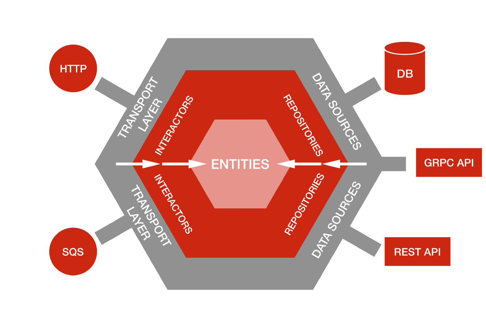

# Architecture

There are multiple definitions for the term architecture, depending on the context, and the development branch you come from. For these reasons is complicated to reach a consensus and a single definition that is valid for all cases. So, according to frontend software development, and from a professional point of view, the definition could be the next:

**Developers call architecture the set of development patterns that allow us to define guidelines to be followed in our software in terms of limits and restrictions. It is the guide that we must follow to order our code and make the different parts of the application communicate with each other.**

There is a wide range of options when it comes to choosing one architecture or another. Each will have its own advantages and disadvantages. Even once we choose which one is the best suited to our case, it does not necessarily have to be implemented in the same way in different projects.

However, although the amount of options is almost infinite, the most keep their quality attributes in common, such as: scalability, single responsibility, low coupling, high cohesion, etc.

So, in general way, it's crucial to understand the concepts, and the reason why you have chosen one solution or the other.

One of the most used patterns to design software architecture is Hexagonal Architecture, also known as Ports and Adapters.

The purpose of this pattern is to divide our application in different layers, allowing it to evolve in an isolated way and making each entity responsible for a single functionality.

## Why is this architecture called Hexagonal? 

The idea of representing this architecture with a hexagon is due to the ease of associating the theoretical concept with the visual concept. Inside this hexagon is where our base code is located. This part is called **domain**.

Each side of this hexagon represent an interaction with an external service, for example: http services, db, rendering..

The communication between **domain** and the rest of actors is performed in the **infrastructure** layer. In this layer we implement a specific code for each of these technologies.

​											The dependency graph in Hexagonal Architecture goes inward.

In Hexagonal Architecture all dependencies point inward — our core business logic does not know anything about the transport layer or the data sources. Still, the transport layer knows how to use interactors, and the data sources know how to conform to the repository interface.

One of the most recurrent question among professionals that see this architecture for the first time is: Why a hexagon? Well, the use of a hexagon is only a theoretical representation. The number of the services we could add is infinite, and we can integrate as many as we need.

## Same concept different names 😒

Hexagonal Architecture pattern is also called **Ports and Adapters**. This name come from a separation within a **infrastructure** layer, where we will have two sublayer:

- **Port**: It is the interface that our code should implement in order to abstract from technology. Here we define the method signatures that will exists.
- **Adapter**: It is the implementation of the interface itself. Here we will have our specific code to consume a concrete technology. It's important to know that this implementation should NOT be in our application, beyond the declaration, since its use will be realized through the **port**.

So, our domain will make calls to the sublayer that corresponds to the port, being decoupled from the technology, while the port, in turn, will consume the adapter.

The **Ports and Adapters** concept is very linked to object-oriented programming and to the use of interfaces, and maybe, the implementation of this pattern in functional programming could be different from the initial concept. In fact, it has arisen many patterns that iterate over this, such as **Onion architecture** or **Clean Architecture**. At the end the goal is the same: divide our application in layers, separating **domain** and **infrastructure**.

## How does it affect maintainability? 🧐

The fact of having our code separated in layers, where each of them has a single responsibility, it helps each layer to evolve in different ways, without impacting the others.

Also, with this segmentation we get a high cohesion, where each layer will have single and unique responsibility well-defined inside the context of our software.

## How does it affect the frontend? 😮

There are currently a number of shortcomings in the use of methodologies when creating applications. Today, we have an incredible amount of tools that allow us to develop applications very fast, and at the same time, we have put the analysis and implementation of known and proven architectures on the back burner.

Notwithstanding, even though this architectures may appear to be from the past, where the languages didn't evolve so fast, these architectures has been showed and adapted to give us the scalability we need to develop actual applications.

## Historical context 😴

Two decades ago desktop applications were the main tool to develop. In them, all our application was installed in the machine, through libraries, and there was a high coupling between view and behaviour. Then, we wanted to scale our applications to get a software more maintainable, whit centralized databases. So many of them were migrated to a server. With this, our desktop apps were reduced to a "fool" applications, which didn't require access, persistence or many data. Finally, if the app needed some data, it had the responsibility to perform this calls to the external servers through network services. It's here when we started to distinguish between "frontend" and "backend".

During the next years we got the web boom. Many desktop apps were adapted to the browsers, where the limitations were higher with only HTML. Later, JAVASCRIPT started to give more possibilities to the browser.

## Present 😌

The views had always been limited only to data representation and them had never needed higher functionalities, until now. With the common needs, frontend applications have more requirements than years ago. To name a few examples: state management, security, asynchrony, animations, integration with third party services...

For all of these reasons, we need to start to apply patterns on these apps.

## Consequences 🥳

As we have said, the purpose of the frontend is mostly to visualize data. Despite this perception, it is NOT the **domain** of our application, but belongs to the outer layers of the implement architecture.

The use cases of the app do belong to the **domain**, and they shouldn't know how the data must be visualized.

For example, suppose you are developing a shopping cart. One use case could be: "A shopping cart can not have more than 10 products". Another use case: "A shopping cart can not have the same product twice or more". We can see the use cases as requirements in our application.

The data requests to backend belong to **infrastructure** layer, and it is something that our app doesn't need to know, even if we manage the backend (it is a different applications and has different architecture needs. At some point, the data scheme of backend could change, and we don't want to our app can be affected by that.

Another part that belong to **infrastructure** is the management of local data, like session data, cookies or local databases. Of course, we have to deal with this, but it is not part of our **domain**.

## Final words 🤗

As we have seen, implementing a good architecture will allow us to improve the code maintenance. Also, we will be decoupled from the framework/library we are using, adding more value to the **domain**.

Don't forget that this pattern can be combined with other concepts, like DDD, Functional Programing... Notwithstanding, the purpose of this example is to give a basic idea of how we could implement hexagonal architecture in a frontend project.

## References

* https://herbertograca.com/2017/11/16/explicit-architecture-01-ddd-hexagonal-onion-clean-cqrs-how-i-put-it-all-together/comment-page-1/
* https://github.com/juanm4/hexagonal-architecture-frontend#same
* https://dev.to/dyarleniber/hexagonal-architecture-and-clean-architecture-with-examples-48oi
* https://codingcanvas.com/hexagonal-architecture/
* https://jayrambhia.com/blog/ports-adapters-intro
* https://medium.com/idealo-tech-blog/hexagonal-ports-adapters-architecture-e3617bcf00a0